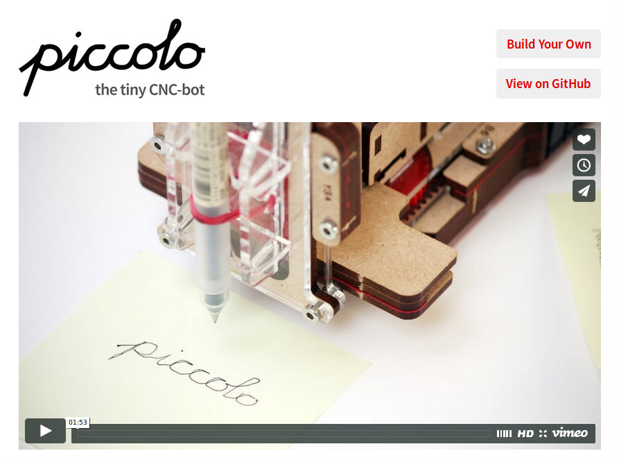
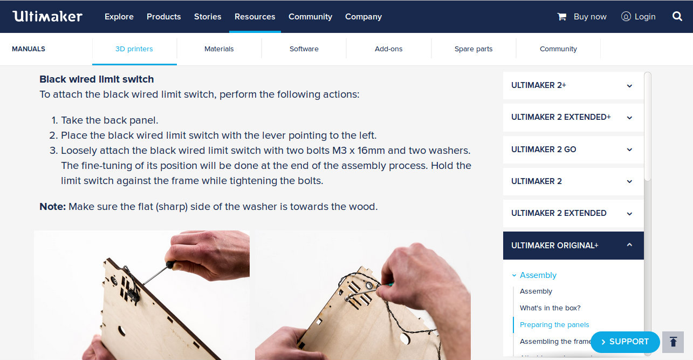

# Documenting your project online

## Tool to use:

There is a variety of tools and platforms that you can depend on, in order to document your projects.  Here is a sample of a few:

1. [Wordpress](https://wordpress.com)  A simple blogging tool that has free template which can help you create an initial landing page for your project.  You can easily install it on your server through your domain provider. You can link your blog to your social media accounts where you post images and videos about meetings and progress.
2. [Instructables]( http://www.instructables.com).  An open community of people who make things.  You can find projects shared by others and an easy way to document your project step by step.
3. [Hackaday](http://hackaday.com) is another place that can host your tutorials and work on progress.  It is good to use different online documentation platforms as it helps you grow your online community base.
4. [Arduino forum:](https://forum.arduino.cc)  If you are Arduino base, make sure you drop a line about your project in the Arduino form.  Something along the lines of "Hey, I am currently building this" or ask for help or simple ask for feedback.
### Examples of documented projects:

Below are samples of hardware opensource community oriented projects that share a ver detailed documentation, making it easy for others to replicate their ideas, join their efforts, or at least engage and understand what are they building:

####Microslicer
So, Microslicer is a very small laser cutter, that is fully opensource. It is developed by one person, who shared his experience in details in an [instructabels post](http://www.instructables.com/id/The-MicroSlice-V2-Aurum-A-gold-mini-laser-cutter-e/):

1. First, the initial lead part of the post, makes it clear, in a glance what this project is about

2. The Bill of materials is very detailed and supported by images and links to where to buy from.

3. Details.  Everything is super detailed, even a tiny detail such as how to color your parts without making a mess.

4. Details are important, and things could get tricky if you are explaining something like circuity and you want to make it newbie friendly.  
5. 
Well, the target of documentation here is not to give an intro to electricity. When you document your hardware project, the target is to make things as clear and as legible as possible for other to follow the logic and become able to replicate it. Use images and easy plug and play techniques, AND, use advanced schematic wiring, for those who are able to dig more.

#### Piccolo
Piccola is a tiny wonderful bot that can be used as a drawing bot.  It is made entirely of laser cut parts joined together. The parts are small and it has lots of details, but the clear and detailed documentation makes it easy for other to follow and copy the project.  Lets start by where documentation resides and how it works:

The lead section of their landing page, makes it easy to understand what this project is about. In 3 seconds you can understand what is the project, watch it in action, and even check how to build your own.

#### Rishalaser
Rishalaser is an opensource laser cutter that works via mobile.  Their website is hosted on a wordpress template, and they use a mediawiki plug in, for their documentation page.  Their documentation is mostly viusal, with a plug and play style.

#### Ultimaker?
Well, even complex project that have now gone commercial do have a clear and detailed documentation of their opensource project. Ultimaker the best seling 3D printer, offers a comprehensive and super detailed quide to how to build each of their designs.

