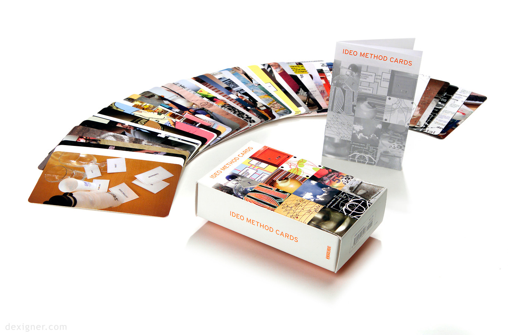
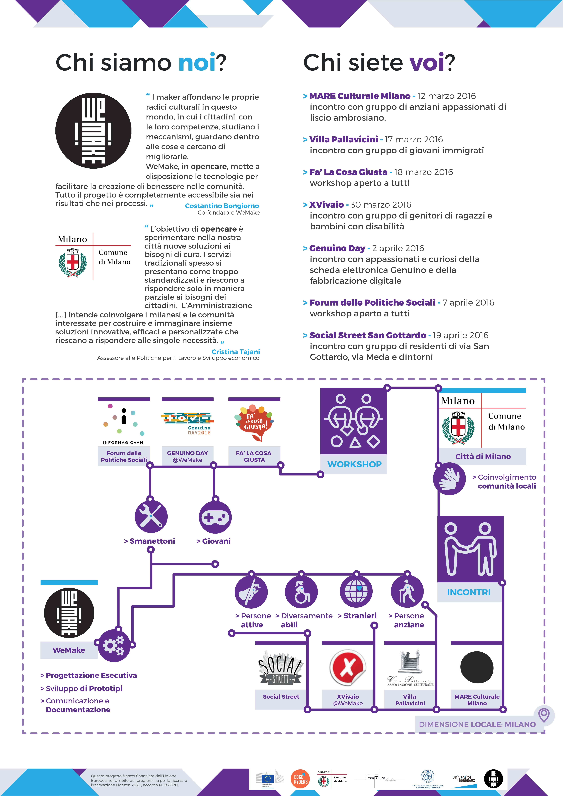
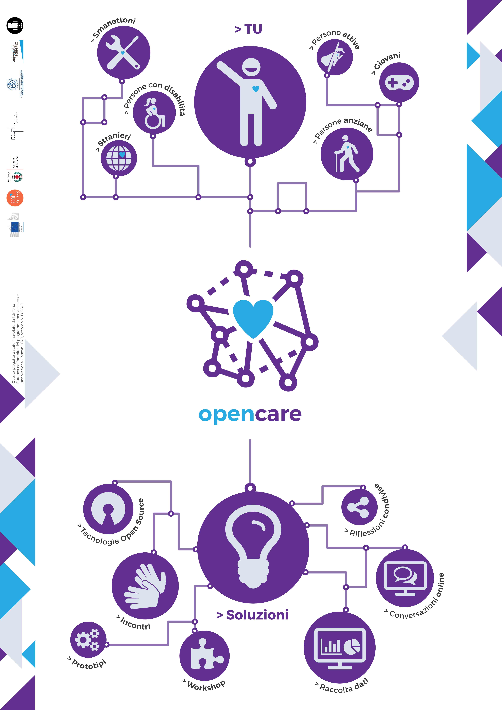
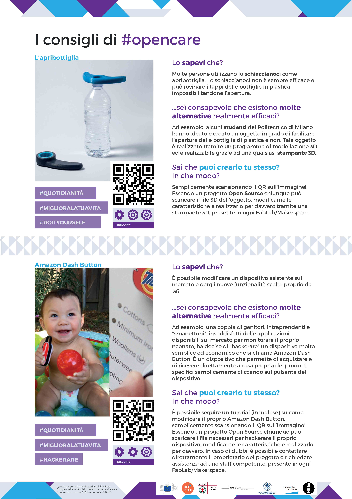
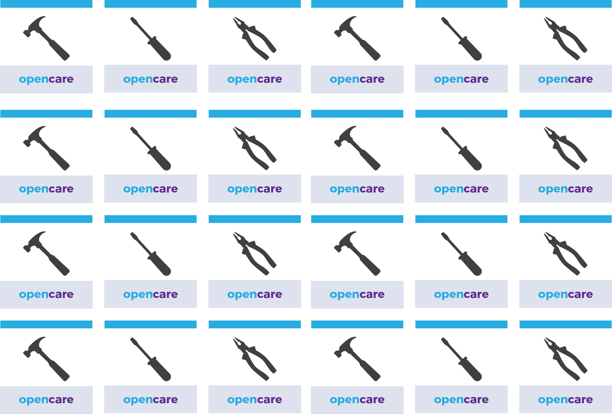
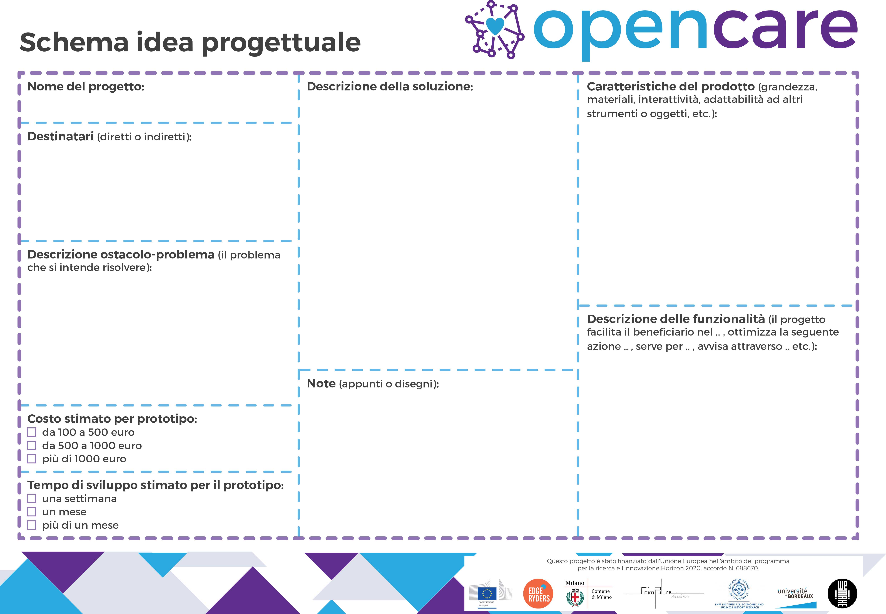

# Find the right tools

CARDS - METHODOLOGIES 

#### **// Description**
Now you have the **Who** (participants), the **What** (goals), and part of the **How** (elements/features). We need to define the other half of the How, which are the **design tools**.

These are the instruments that you will use to play your **symphony**. You will have to tune them harmoniously and they will help you reaching the goals.
Collaborative design, as you know, is a discipline. And like any other practice it requires the user to **learn**, **discover** and **test** different ways, in order to find the most suitable one.

We have already said before that **this is not an exact science**, therefore it will be impossible for us to suggest you a set of tools that will be perfect for your activity. You will have to dive deep and discover by yourself which one is fitting your requirements at its best.
Don’t worry, we will assist you in this path as much as we can.

Let’s start thinking about what you have so far: Who, What and ½ How. In the previous tip you set the duration and repetition of the activity. Keeping this in mind, you have to find the best way to reach your **desired deliverables**. One way could be sitting around a table and talking with your participants about your project/topic/idea until you have got enough insights/information.
But co-design is much more than this. Therefore we suggest you to take a look at some interesting and useful set of tools, that may be just right for you.

Part of the selection will be **supported by what you have defined so far**: if you have just 2 hours of availability then you are not going to choose a prototyping experience, that may take much longer than that.

A very useful and inspiring set of tools that you can check is the **method cards**. In particular, we suggest you these two toolkits: **[IDEO Method Cards](https://www.ideo.com/work/method-cards)** and **[FROGDESIGN Collective Action Toolkit](http://www.frogdesign.com/work/frog-collective-action-toolkit.html)**.

* The first one is a deck of cards that you can purchase online. There are 51 cards, and each card represents one tool. The tools are split in 4 different categories: **Learn**, **Look**, **Ask**, **Try**, according to your aim.
Furthermore, the tool itself is structured as follows: **HOW** (description of the action), **WHY** (reason why you should use it).

* Collective Action Toolkit, on the other hand, is a PDF that you can download. As well as the previous one, every tool is split in different categories: **Clarify your goal**, **Build your group**, **Seek new understanding**, **Imagine more ideas**, **Make something real**, **Plan for action**.
The toolkit is very well structured because it suggests simple or more articulated sequences of tools. Every single tool is divided into steps, that will help you structuring the activity. Other aspects are also pointed out, such as **Time**, **Roles** and **Materials**.

These sets of tools will be able to **inspir**e you and give you the possibility to **select** properly according to your aim, time, participants, exc.

Design method is a world that **needs to be discovered**, and that is a great way to start.

Another interesting website, but unfortunately a little bit outdated, is [www.servicedesigntools.org](www.servicedesigntools.org). Here you will be able to navigate and explore a variety of methods and connected case studies.

Even though these databases are rich of useful hints and tools, there is the possibility that none of them satisfies completely your needs.
Unfortunately, these kind of situations happen.

In this case we suggest you to get inspired and then try to **design your own tools**. In order to do that you need to have some knowledge of collaborative design and surely even a little experience.

Secondly, you need to work with a **team**. Having different competencies is precious, and would become helpful in moments such as this one.

Beware, this way is risky and may imply failure. But don’t be afraid of this, just take your time to experiment and test your tools before the activity.

#### **// In other words**

* Sum up your **Who**, **What** and **How**, that you have defined until now

* Search among **existing tools** the one that is more efficient for you

* Try and **experiment** it before the activity

* Design **your own tool**, taking inspiration from existing ones

* Take advantage of the **competencies** of a well assorted team

####**// opencare experience**
What we have explained above is exactly the path that we followed in the **opencare** project.

In order to define our tools we firstly started **checking the existing ones**, we analyzed them and got inspired. At the moment of team discussion we pointed out all the benefits of the various tools and we evaluated them.
However we understood that they were not perfectly fitting our needs. For this reason we decided to **design our own**.

Our co-design session was meant to involve a variety of people in order to identify care needs/issues and related solutions.
As we mentioned before, we decided to split the sessions in two days; each activity lasted nearly 4 hours.
During the activity planning we tried to understand what kind of tools would have been helpful for us.

**1st session**

In the first session we wanted our participants to feel **comfortable**, to **learn** about the project and understand clearly what would have happened during these two meetings.

At the end of the first session our aim was to get a list of personal needs that we could analyze and rearrange in order to be a starting point for the second session.

To achieve this we prepared some **slides** that we decided to present to all the audience at the beginning of the evening.

###### *(See [Be clear and complete about the project/meeting/outcomes](be_clear_and_complete_about_the_projectmeetingoutc.md) for more details about our slides)*

We also designed 4 **posters** representing:
* What is opencare

* Who we are and Who you are

* opencare light System Map.

The last poster was about two case studies well representing the spirit and ideology of **open source care solutions**.
They were all sticked on the walls, in order to be seen by everyone entering in the makerspace.

Since we planned to work in 3 groups we prepared some **stickers** representing the three names of the groups: “Hammer”, “Pincer”, “Screwdriver”. The stickers were meant to be given to the participants at the beginning of the activity, in order to be placed on their t shirts and to **create the groups**.
(The distribution of the people within the groups was decided by us, to create clusters with different people according to age, profession, competencies, exc.)

We decided to divide the session in three parts: **individual** one, **collective** one, **plenary** session.
We wanted the first one to be very **intimate**, lasting more or less 15 minutes, in order to let each participant focus on one or at most two practical needs in the sphere of daily care activities.

The tool that we designed for this purpose was the **Obstacle Paper**. On this paper we asked them to write or draw a specific need that together we could have found a solution to.
After filling the sheet we wanted each group to **discuss** about the different needs, and decide, with the help of a moderator, which specific needs they wanted to take care of and present to other groups during the plenary session. To take this decision we provided them **big blank sheets of papers and sharpies**. These tools were useful to inspire them and help them delineating on a poster their flow of thoughts.

**2nd session**

The second meeting had the goal of finding with the participants **three solutions** to three previously identified problems.
Before the session we rearranged the material in order to summarize the work completed the week before. We structured an A4 paper with the **issues emerged**, clustered by topic.

The aim was to give everyone a copy of the Obstacles to refresh in their memory the different needs and help them choosing the one they were more interested into. We also prepared 9 **slides** to present them, before starting the activity, all the tools that we would have used, to make them more familiar.

After the presentation the participants decided which group they wanted to join, according to their preference and personal opinion.
They divided themselves, and started discussing about the issue.

The first tool they had to use was the **Project Sheet**, an A3 paper regarding some questions and characteristics that the group would have had to fill, in order to delineate the solution in a more precise way. The questions of the Project Sheet were:
* **name** of the project
* **people** addressed
* the **obstacle/issue** that they wanted to solve or overcome
* estimated** cost** of the prototype
* estimated **time** to develop it
* description of the **solution**
* **characteristics** of the project
* description of its f**unctionalities**
* notes

Every group, as in the previous session, worked with a moderator that helped them to keep the focus.

Another tool that we decided to provide them was the **Evaluation Indicators** and **Evaluation Cards**.
This tool was particularly important for us. Our aim, as we said before, was to end up the co-design session with 3 solutions to 3 existing problems. After analyzing and evaluating each solution proposed we had to decide which one of those three solutions we would have prototyped. In order to make this selection we designed a deck of cards with the indicators that we took into account during the decisional process. Here you can read our evaluation principles:

(OC-Evaluation_matrix.pdf pag. 3 and 4)

This tools was shared with the participants to make them shape their solution in a more **appropriate** way, trying to think about a **feasible** project and to help them following a path. Many participants, indeed, didn’t have any experience of design thinking and generating solutions. This tool was designed to **simplify** and lead the process.

(OC-Indicatori.pdf)

At the end of the second session all the groups completed the Project Scheme and presented their solutions in plenary session.
After this all the decisions were depending on us. We took few weeks to **evaluate the projects** and research about existing products solving similar problems. Therefore we elaborated a new tool, used by our team, that we called **Evaluation Rubric**. This document helped us assigning points and understanding which project was the most suitable to be prototyped.
We then scheduled a third meeting, to communicate our decision and further steps.

For all the above mentioned activities we referred to the **Open Space Technology**, which was adapted to our tools and can be defined as:

> a process that focuses on expanding time and space for the force of self-organisation to do its thing. Although one can't predict specific outcomes, it's always highly productive for whatever issue people want to attend to. Some of the inspiring side effects that are regularly noted are laughter, hard work which feels like play, surprising results and fascinating new questions.

([https://en.wikipedia.org/wiki/Open_Space_Technology](https://en.wikipedia.org/wiki/Open_Space_Technology))

###### *(See this[ PDF](http://elementaleducation.com/wp-content/uploads/temp/OpenSpaceTechnology--UsersGuide.pdf) if you want to get more information about Open Space Technology)*