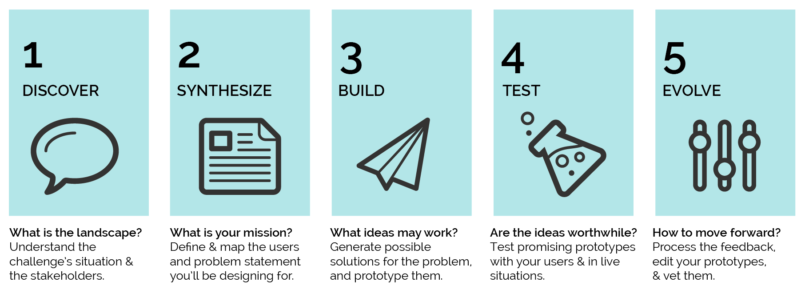

## Is there a process I can follow?

In our experience of years of making projects, helping people to make projects and teaching students how to make projects, we have found out that the **Design Process** is the one that covers all the basic aspects of prototyping solutions. It usually works seamlessly in a variety of fields, contexts and technologies involved.

A user-centered design process usually follows these five steps:

(http://www.legaltechdesign.com/LegalDesignToolbox/develop-a-new-project/)

Rather than being a strict set of rules it's more like a series of different stages of a flow that ends up in a possibly endless loop of iterations. Sometimes it tends to feel so natural you won't even feel you are following a methodology.

#### // How does it work then?

***Discover - ***Sometimes you start with a brilliant idea, lucky you! Most of the times you actually start by just facing a need or a series of needs. Those needs they usually have emerged in a certain context. As the first step you define this context, the area you are going to work in.

You analyze and try to find out:

* Who are the stakeholders involved
* What kind of characteristics does the context have

For instance, an issue deeply related to shortness of breath may have a bigger impact on a community of people doing fatiguing manual labor rather than a desk job. 

***Synthetize - ***If the first phase of research will help you focus on the area of the problem, this second phase will help you define the problem and the people affected by it, the people you are gonna work for and with, your users.

After researching your potential users, you represent the archetype of your average user.

You brainstorm around the needs and the users and you go deeper adding details, like use cases and scenarios.

|TIPS|
|-|
|Creating **personas** will help you visualize what your users do really care about|
|There are many ways to approach a brainstorming session, usually we experienced that the oddest from your usual scenario you go, more interesting the thoughts will be! In other words embrace talking, confrontation, trying to feel part of the problem|
|**Try to experience the scenarios** to understand more about the real needs|
|**Look around and take inspiration from good examples**|

***Build -*** With your best ideas try to create quick prototypes, so that you can see with your own eyes and touch with your hands if it's something worth to spend more time on or not.

|TIPS|
|-|
|Fail early. **The faster you get to a working prototype the least time you will waste on a possibly pointless idea**|
|Finding the right balance between working too much or not enough on a prototype is tricky. **Try not to waste too much time on details but be sure you have all the main features**|

*For more info on how to build a prototype you can refer to the  [next part of the chapter](what_kind_of_technologies_can_i_use.md)*

***Test -*** This is possibly the most important and too often forgotten phase of the whole process. Once you have a working prototype in your hands you are only at the beginning of your trip. Now, go out and test it
* in every possible condition!
* with any possible users!

Testing is not easy, it requires time and logistics to organize the testing sessions, experience in talking to people, and improvisation so that you can **make any of the interviews useful for your research**.

***Evolve -*** The last phase is also the first of a new loop. Analyze the feedback received and use it to learn and move forward, iterate your prototype and then test again until you have something that satisfies your users!

As easy as it may sound this could probably be the hardest time of your process. Accepting your possible failure is tough.

|TIPS|
|-|
|**Try not to make your special baby out of your idea**, and prototype. It's just the first one of a series, really. It will grow and be better and more solid thanks to the other world, just like your baby!|
|**Be flexible, you're probably not this great mind you might have thought of, don't overestimate your intuitions**. It's with feedback from others, and sometimes conflict, that you can produce a better solution that will actually answer to a real problem.|
|**Be patient, it might take a lot of iterations** and blind trial and error before you get to the right solution|

At some point you might have a prototype that will actually answer to your users needs, congrats!
But, unfortunately this is not guaranteed. You might spend a lot of time iterating and not finding the solution you are looking for. Maybe you can go back and try with one of the other discarded ideas!

#### // Conclusions

The design process is powerful because it puts the user at the center. The technology, the methodology, the materials fall inevitably to the background.

A brilliant technological solution without users will just be a well executed excercise (or maybe a study), an innovative device that won't be used by people will just be a mass of decaying particles.

The user-centered design process will give you and your idea the legitimacy to go ahead and invest in the project.