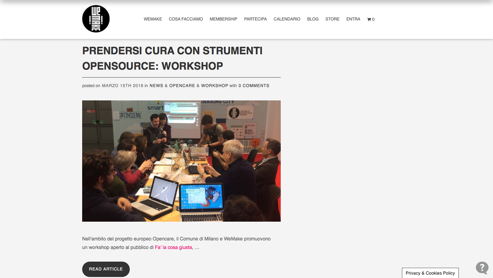
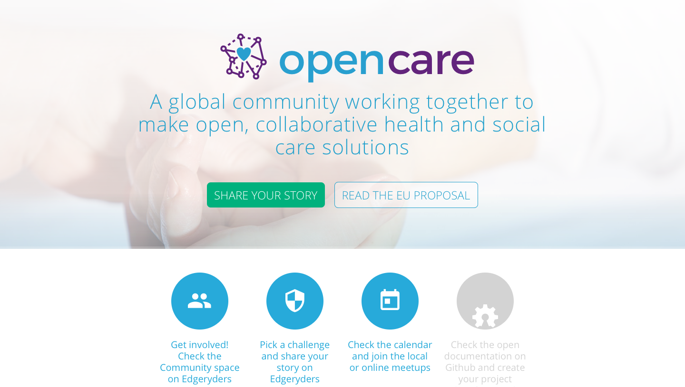
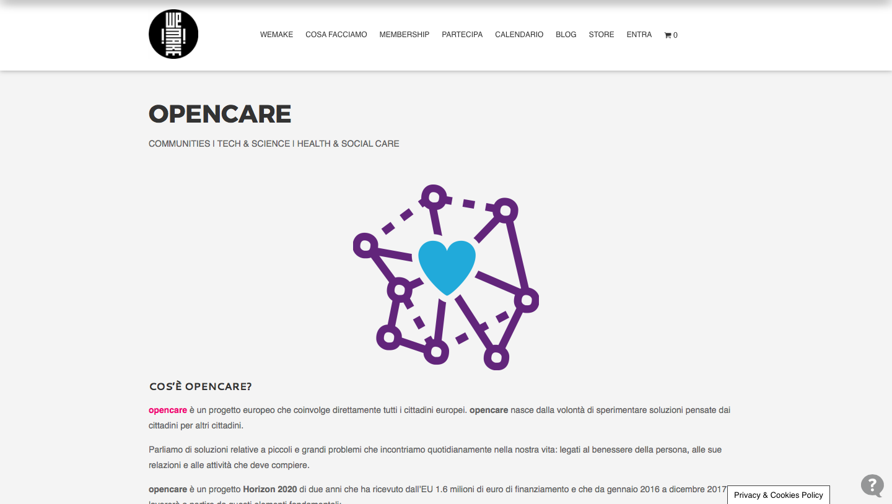
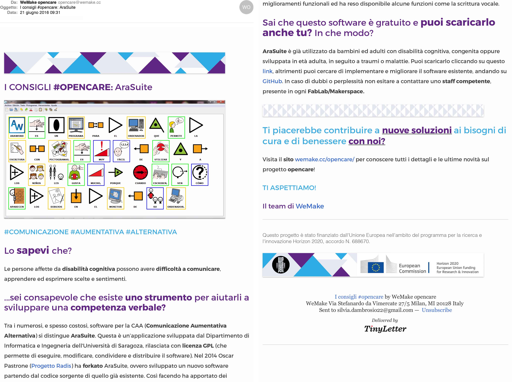

# Keep the interest alive - Part I

WEBSITE - LANDING PAGE - NEWSLETTER - BLOGPOST

#### **// Description**

Once you have defined which kind of **communities** and **people** you are going to **collaborate** with, you are ready to start improving and enhancing the **relation** between your staff and your further participants. Obviously, there are plenty ways to engage and contact people, but keep in mind that the two main strategies, the online and offline one, are complementary since both of them are not totally efficient. One requires the other one and vice versa. In this tip we are going to talk about the **online channels** that we used to get more in touch with people. 

###### See [How to involve citizens in a local community?](how_to_involve_a_local_community.md) if you want to know more about the offline activities.

So, moving on, thanks to the new technologies, there are now many tools available to create links and connections between people. Moreover, there are plenty of channels given by the **global network**, such as: social networks, newsletters, blogs, forums, websites, exc. It is mandatory to choose the **right channels** in order to set up the right basis for a collaborative design approach. The choice mainly depends on which kind of informations you want to spread through those channels and to whom. 

Here some examples of the current *online* channels: 

* **Website**: it allows the final target to get the **most important informations** about the project. It must be as more clear, *functional* and understandable as possible. 
* **Social networks**: like “Facebook”, “Twitter”, “Google+”, “YouTube”, “Instagram” and so on. They are all different, but all of them lead to the same purpose which is to make a **large number of people** (even with different age) aware about some **imminent topics**. They must be updated continuously. 
* **Newsletter**: it can have different goals, like sending some discounts, updates, invitations to an event, exc. Be careful! It requires a *mailing list* and it must contain an interesting and winsome topic, otherwise it will be considered as **spam** and binned immediately. 
* **Blog**: it allows people to have an unfading **database** of informations and past events. It can be like a *diary* or a list of occurrences. There should be the possibility to leave a **comment** in order to allow people to start a discussion about a specific topic. It must be tidy, in other words, the staff must pay meticulous attention to organize all the posts and stories, they should be divided into categories by tags, dates, places, actors, keywords, exc. 
* **Forum**: as all the other online channels explained above, also the forum requires continuous *maintenance*. Maybe more than the other ones. It allows people to *discuss* about various topics, but still it is a perfect place to make **questions** and receive **replies** from both experts and principiants. This last point may be considered both a pros and cons, since the forum visitor can reach the accurate information required. It must have, especially at the beginning, some “**moderators**” who have to manage and oversee all the discussions. 

Try to answer to the following questions, they may give you the starting point which are useful to define your best online strategy:

* Which kind of **informations** do I want to spread?

* **Who** do I want to contact/inform/invite/...?

* Which is the **best channel** for my "target"?

* Does (Facebook) **fulfill** my purposes?

* How (Google+) can **contribute** to my project? 

* exc.

After choosing all these **key factors**, keep in mind that a pipeline will be more than appreciated. It is almost necessary to organize the releases in a strict **schedule** since it will make your staff able to define the roles and the timelines, who does what and when. It is a bit a time consuming at the beginning, but it will avoid further wasting time. Trust us, it is very helpful!

###### See [How to involve citizens in a local community?](how_to_involve_an_online_community.md) for more details.

#### **// In other words**

* Define **who** you want to get more in touch with;

* Decide which kind of **informations** do you want to spread;

* Choose in which **channels** do you want to share your infos;

* **Schedule** a pipeline of the content releases. 

#### **// opencare experience**

Since the beginning of our co-design experience, we have had to create a **solid online strategy**. Not only to involve the current online communities but even for bringing new local communities into it. We had to design and adapt all the contents, from time to time, to new channels according to the different phases of the co-design. In these last six months of activities we moved through two main parallel directions, one based on the **engagement** and the other one based on the aim to provide a **basic knowledge** about **opencare** project. 

So, first of all, we engaged people by means of **invitations** and **general posts** shared on social networks (Facebook, Twitter, Google+ and YouTube), emails and our **blog**. 

Then we found out that an appropriate **basic knowledge** was necessary in order to have an efficient co-design with citizens, so we started to revise and re-design the **opencare website** and its **landing page**. 

([http://opencarecc.github.io/OpenCareLandingPage/](http://opencarecc.github.io/OpenCareLandingPage/))

([http://wemake.cc/opencare/](http://wemake.cc/opencare/))

But that is far from enough, we started sending a **newsletter** about some projects that might be useful for gaining a **first approach** and a **better understanding** of the wide world of open source products and services for care. In these newsletters we used colloquial words and expressions in a *three-questions template*. This because, since our “target” was mainly composed by “no-tinkerer people”, we wanted to make those projects as more comprehensible as possible to them. We wanted to **arouse curiosity** but at the same time we wanted to **make people feel valuable**. At the end of the newsletter we always put our *contacts*, and sometimes the invitation for a specific event (the two co-design sessions, some other workshops, exc).

