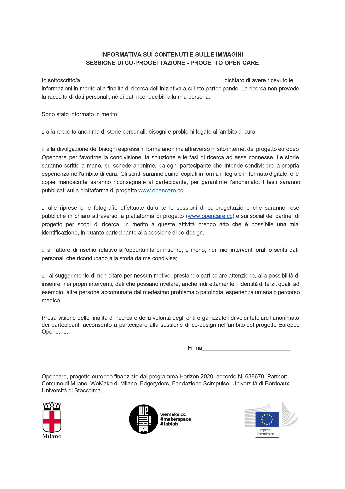

# Pay attention to the context

VARIETY - TONE OF VOICE - LANGUAGE

#### **// Description**

One of the first things that you need to understand is the **type of community** that you are involving or willing to involve.

###### *(see [How to involve citizens in a local community?](how_to_involve_a_local_community.md) in order to gain deeper insights)*

If you decided to structure a co-design session it means that you have an aim, a strong reason; whether you are trying to **gather information** about a specific topic, or you are willing to **improve** the characteristics of your product/service with the help of your customers, or again you want to find an **innovative solution** to an identified problem, you need to **involve** a community of people.
Understanding your community is one of the first fundamental steps, because according to it you will have to **shape your tone of voice**.

Some people, for instance, may not understand technical terms on which your research is based on.
In this case you may want to choose one of the following options: **simplify** your language; **explain** during the process the meaning of those terms; **prepare** your audience in advance, giving them the possibility to face the reality they will have to jump into.
Therefore, if you are leading a research project you may have to work with people that are not necessarily experts/specialists, and that may have difficulties to understand the general context, if your language is too structured.

Another element you need to be careful about is the **delicacy** of the topic you are working on.
If you are willing to involve people in an activity that partly violates their **privacy**, or that regards personal information, you need to let them know in advance and we suggest you to be careful about the terms/activities you may want to use. It is important to protect them first, and then yourself, by being transparent with them about the use of the data and about sensitive information.

Lastly, consider the possibility of having a **various audience**. In this case you will have to adjust the tone of voice and activities in order to make every participant at the same level (if this is your aim, obviously). Remember that the aim of the collaborative design activity that you are structuring has to **be clear** to every single attendee, therefore your explanations will have to be structured in order to be understood by all of them.

#### **// In other words**

* **Modulate** your tone of voice according to your audience

* Make the aim and structure of the activity **clear** and** understandable**

* Pay attention to the **privacy** of participants and sensibility of the topic

* Evaluate the **variety **of the participants and shape your tone of voice accordingly

#### **// opencare experience**

During the definition of our co-design session we had to take into account a number of elements and characteristics that were crucial in order to obtain a successful activity.
First of all we had to relate with **various communities** and groups of people, characterized by **different ages** and **life experiences**.
Since we are talking about our **local experience**, it is important to underline that the main language we used was Italian. Some words, however, were written and pronounced in English (first among everything the title of the project: **opencare**). This was one of the main obstacles that we encountered, because some participants didn’t know the **foreign language**, therefore they had problems with understanding the meaning.

Another obstacle was related to the **complexity of terms** that are daily used in fablab/makerspace environments, but rarely in common situations.
In order to fix this problem on the one hand we **simplified** the language, on the other hand we organized some meetings and workshop with the aim of making the participants **get close **to the technologies and terminologies relevant for us.

Lastly, **privacy** has been a pressing issue for us.
Since **opencare** co-design session regarded personal
 stories related with **health** and **social care**, we clearly talked with the communities involved and pointed out that their stories would have been anonymously published on our online platform EdgeRyders, and that we would have recorded the activity itself with microphones and cameras. Those people who agreed signed a paper which stated that they had been informed and that they accepted to share all the generated content.
In this way we managed to protect both parties.
